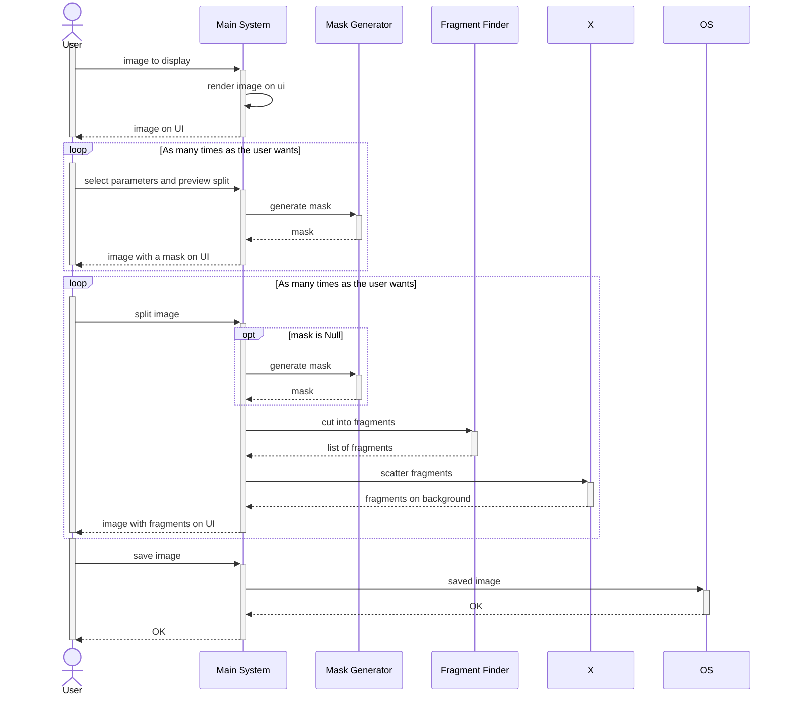

```mermaid
sequenceDiagram
    actor U as User
    participant MS as Main System
    participant MG as Mask Generator
    participant F as Fragment Finder
    participant X
    participant OS

    activate U
    U ->> +MS: image to display
    MS ->> MS: render image on ui
    MS -->> -U: image on UI
    deactivate U

    loop As many times as the user wants
        activate U
        U ->> +MS: select parameters and preview split
        MS ->> +MG: generate mask
        MG -->> -MS: mask
        MS -->> -U: image with a mask on UI
        deactivate U
    end

    loop As many times as the user wants
        activate U
        U ->> +MS: split image
        opt mask is Null
            MS ->> +MG: generate mask
            MG -->> -MS: mask
        end
        MS ->> +F: cut into fragments
        F -->> -MS: list of fragments
        MS ->> +X: scatter fragments
        X -->> -MS: fragments on background
        MS -->> -U: image with fragments on UI
        deactivate U
    end

    activate U
    U ->> +MS: save image
    MS ->> +OS: saved image
    OS -->> -MS: OK
    MS -->> -U: OK
    deactivate U
```