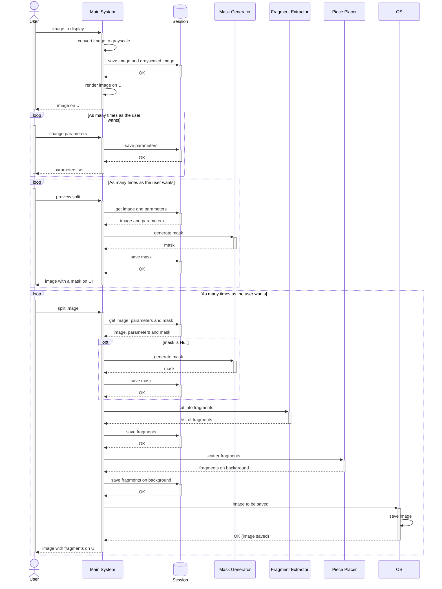

```mermaid
sequenceDiagram
    actor U as User
    participant MS as Main System
    participant S@{ "type" : "database" } as Session
    participant MG as Mask Generator
    participant F as Fragment Extractor
    participant P as Piece Placer
    participant OS

    activate U
    U ->> +MS: image to display
    MS ->> MS: convert image to grayscale
    MS ->> +S: save image and grayscaled image
    S -->> -MS: OK
    MS ->> MS: render image on UI
    MS -->> -U: image on UI
    deactivate U

    loop As many times as the user wants
        activate U
        U ->> +MS: change parameters
        MS ->> +S: save parameters
        S -->> -MS: OK
        MS -->> -U: parameters set
        deactivate U
    end

    loop As many times as the user wants
        activate U
        U ->> +MS: preview split
        MS ->> +S: get image and parameters
        S -->> -MS: image and parameters
        MS ->> +MG: generate mask
        MG -->> -MS: mask
        MS ->> +S: save mask
        S -->> -MS: OK
        MS -->> -U: image with a mask on UI
        deactivate U
    end

    loop As many times as the user wants
        activate U
        U ->> +MS: split image
        MS ->> +S: get image, parameters and mask
        S -->> -MS: image, parameters and mask
        opt mask is Null
            MS ->> +MG: generate mask
            MG -->> -MS: mask
            MS ->> +S: save mask
            S -->> -MS: OK
        end
        MS ->> +F: cut into fragments
        F -->> -MS: list of fragments
        MS ->> +S: save fragments
        S -->> -MS: OK
        MS ->> +P: scatter fragments
        P -->> -MS: fragments on background
        MS ->> +S: save fragments on background
        S -->> -MS: OK

        MS ->> +OS: image to be saved
        OS ->> OS: save image
        OS -->> -MS: OK (image saved)

        MS -->> -U: image with fragments on UI
        deactivate U
    end
```