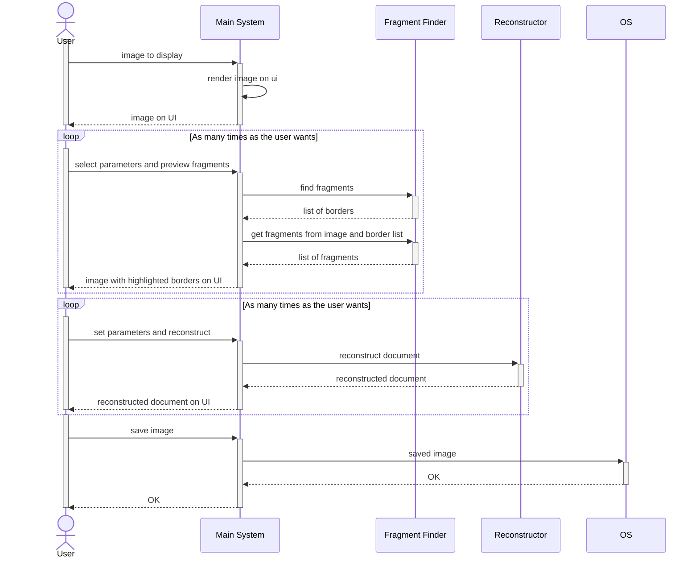

```mermaid
sequenceDiagram
    actor U as User
    participant MS as Main System
    participant F as Fragment Finder
    participant R as Reconstructor
    participant OS

    activate U
    U ->> +MS: image to display
    MS ->> MS: render image on ui
    MS -->> -U: image on UI
    deactivate U

    loop As many times as the user wants
        activate U
        U ->> +MS: select parameters and preview fragments
        MS ->> +F: find fragments
        F -->> -MS: list of borders
        MS ->> +F: get fragments from image and border list
        F -->> -MS: list of fragments
        MS -->> -U: image with highlighted borders on UI
        deactivate U
    end

    loop As many times as the user wants
        activate U
        U ->> +MS: set parameters and reconstruct
        MS ->> +R: reconstruct document
        R -->> -MS: reconstructed document
        MS -->> -U: reconstructed document on UI
        deactivate U
    end

    activate U
    U ->> +MS: save image
    MS ->> +OS: saved image
    OS -->> -MS: OK
    MS -->> -U: OK
    deactivate U
```