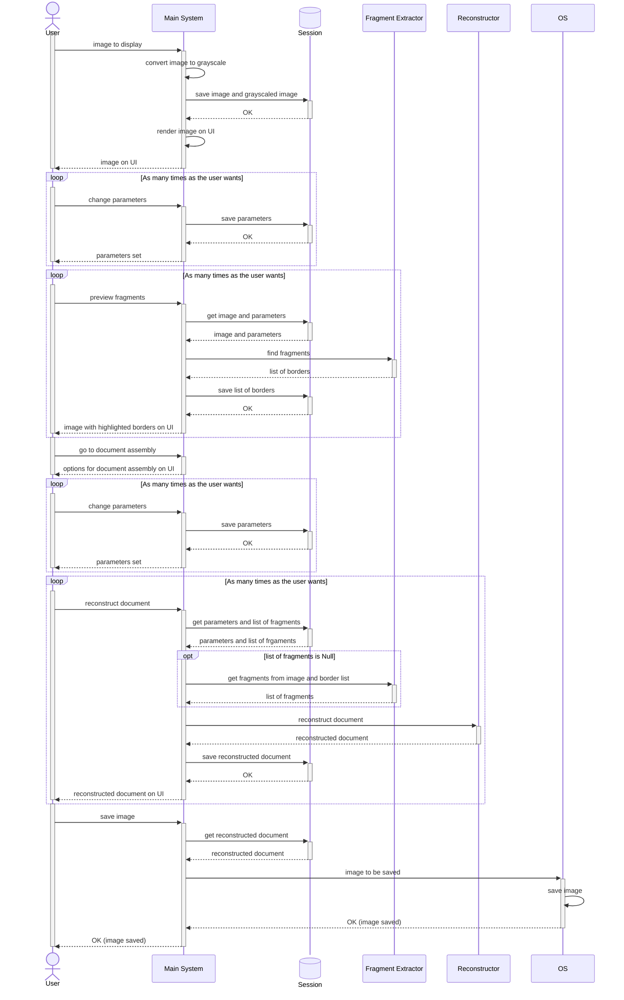

```mermaid
sequenceDiagram
    actor U as User
    participant MS as Main System
    participant S@{ "type" : "database" } as Session
    participant F as Fragment Extractor
    participant R as Reconstructor
    participant OS

    activate U
    U ->> +MS: image to display
    MS ->> MS: convert image to grayscale
    MS ->> +S: save image and grayscaled image
    S -->> -MS: OK
    MS ->> MS: render image on UI
    MS -->> -U: image on UI
    deactivate U

    loop As many times as the user wants
        activate U
        U ->> +MS: change parameters
        MS ->> +S: save parameters
        S -->> -MS: OK
        MS -->> -U: parameters set
        deactivate U
    end

    loop As many times as the user wants
        activate U
        U ->> +MS: preview fragments
        MS ->> +S: get image and parameters
        S -->> -MS: image and parameters
        MS ->> +F: find fragments
        F -->> -MS: list of borders
        MS ->> +S: save list of borders
        S -->> -MS: OK
        MS -->> -U: image with highlighted borders on UI
        deactivate U
    end

    activate U
    U ->> +MS: go to document assembly
    MS -->> -U: options for document assembly on UI
    deactivate U

    loop As many times as the user wants
        activate U
        U ->> +MS: change parameters
        MS ->> +S: save parameters
        S -->> -MS: OK
        MS -->> -U: parameters set
        deactivate U
    end

    loop As many times as the user wants
        activate U
        U ->> +MS: reconstruct document
        MS ->> +S: get parameters and list of fragments
        S -->> -MS: parameters and list of frgaments
        opt list of fragments is Null
            MS ->> +F: get fragments from image and border list
            F -->> -MS: list of fragments
        end
        
        MS ->> +R: reconstruct document
        R -->> -MS: reconstructed document
        MS ->> +S: save reconstructed document
        S -->> -MS: OK
        MS -->> -U: reconstructed document on UI
        deactivate U
    end

    activate U
    U ->> +MS: save image
    MS ->> +S: get reconstructed document
    S -->> -MS: reconstructed document
    MS ->> +OS: image to be saved
    OS ->> OS: save image
    OS -->> -MS: OK (image saved)
    MS -->> -U: OK (image saved)
    deactivate U
```